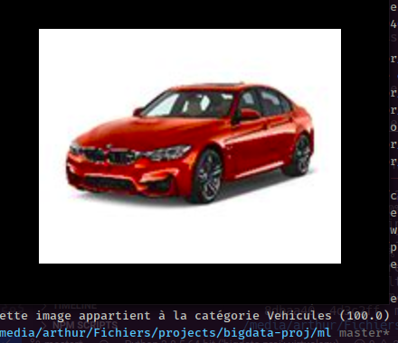

# ATA Project


A Django application that classify sended pictures with TensorFlow and store them with MangoDB
The frontend is made with a sexy design, UX/UI 2020 friendly au pire bouffe moi le poireau

## Install

```sh
cd projet-ata
pip install -r requirements.txt
```

## Config

Create a mongodb database nammed `ata`

```sh
mongo
> use ata
```

Migrate django models to the database

```sh
python3 manage.py migrate
```

## Usage

Launch the django app

```sh
cd projet-ata
python3 manage.py runserver 0.0.0.0:8000
```

Go to [this page](http://localhost:8000/upload)

## Only test model

Specify the path of the tested picture in [config.py](frontend/ml/lib/config.py)

```py
tested_picture_path = "/home/arthur/bmw.jpeg"
```

Launch the python file in terminal

```sh
python3 ml/test.py
```

Appreciate the results



## Contributors

RICHARD Arthur, HAVARD Antoine, ROYANT Tom
